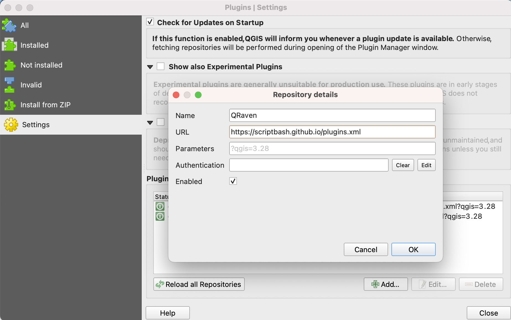
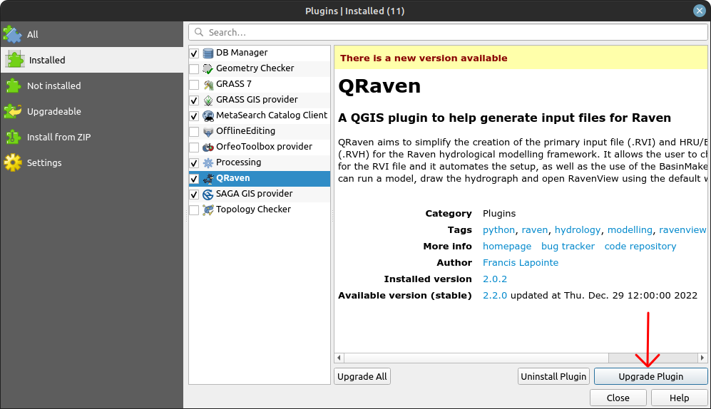

Installation
============

.. _Installation:

Dependencies
------------

To use QRaven, first install a recent version of QGIS (3.20 and above):
`https://qgis.org/en/site/forusers/download.html <https://qgis.org/en/site/forusers/download.html>`_

Some features, such as the BasinMaker tools and the GridWeight Generator, require a containerization software to be installed. If you are not planning on using those features, you can skip this step. 
Otherwise, you can pick between Podman and Docker. 

Get Podman : `https://podman.io/getting-started/installation <https://podman.io/getting-started/installation>`_

Get Docker : `https://docs.docker.com/get-docker <https://docs.docker.com/get-docker>`_

.. warning::
   Linux users who choose Docker must run it as a non root user. This can be done with the following command:

   .. code-block:: console

      sudo usermod -aG docker $USER

   For more information, go to:
   `https://docs.docker.com/engine/install/linux-postinstall/#manage-docker-as-a-non-root-user <https://docs.docker.com/engine/install/linux-postinstall/#manage-docker-as-a-non-root-user>`_

Plugin installation
-------------------

Method 1 (recommended)
^^^^^^^^^^^^^^^^^^^^^^
Open QGIS and go to the "Plugins" menu. Click on "Manage and Install Plugins".

.. image:: https://user-images.githubusercontent.com/98601298/170998843-1fa7c283-e15b-4dce-a684-59e16a5c71d4.png
  :width: 400

Click on the "Settings" tab and click on the "Add" button to add a new plugin repository.

In the window that just opened, enter a name, such as "QRaven", enter the link below in the URL field and leave the remaining options to their defaults:

`https://scriptbash.github.io/plugins.xml <https://scriptbash.github.io/plugins.xml>`_

To update QRaven, simply head back to the plugins manager, search for QRaven and click on "Upgrade Plugin".

Method 2 (manual)
^^^^^^^^^^^^^^^^^
Download the latest release of QRaven here:
`https://github.com/Scriptbash/QRaven/releases/latest/download/qraven.zip <https://github.com/Scriptbash/QRaven/releases/latest/download/qraven.zip>`_

Alternatively, you can view all of QRaven versions here : 
`https://github.com/Scriptbash/QRaven/releases <https://github.com/Scriptbash/QRaven/releases>`_

Next, open QGIS and go to the "Plugins" menu. Click on "Manage and Install Plugins".

.. image:: https://user-images.githubusercontent.com/98601298/170998843-1fa7c283-e15b-4dce-a684-59e16a5c71d4.png
  :width: 400

Finally, click on "Install from ZIP", select the downloaded qraven.zip file and click on "Install".

.. image:: https://user-images.githubusercontent.com/98601298/170999288-1d8db5dc-5709-4139-8aff-412dc76eb1c2.png
  :width: 600

To update QRaven, you will need to download the latest .zip file and repeat the same steps as above.

.. note::
   The plugin will look for an update each time QGIS is started. If it finds one, you will have a notification in the notification bar and inside the "Settings" menu of QRaven.