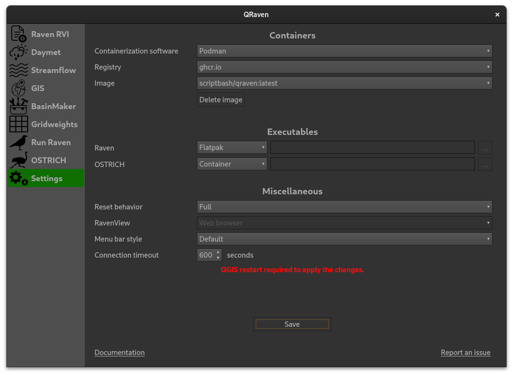

=================================
Create a Raven model step by step
=================================

This tutorial will explain how to build a Raven model from scratch using QRaven.
The HBV-EC template will be used to model the watershed of Dumoine river.

Get the required data
=====================

The data needed can be separated for two uses;

1. for Raven (Temperature, precipitations, streamflow, etc.)
2. for BasinMaker (Landuse polygons, rivers network, DEM, etc.)

Data for Raven
--------------

Streamflow
^^^^^^^^^^

Downloading streamflow data for Canada is quite easy in QRaven. 

1. Click on the Streamflow menu.
2. Since the watershed is in the province of Quebec, we will use the DPPHC data scraper. Make sure the DPPHC tab is active.
3. Search for "Dumoine,Rivière" in the "River or lake" field.
4. Click on the "Search button".
    
    .. image:: ./images/tutorial/search_stream_station.png
        :width: 600

5. Next, copy the station ID of the only operational station.
6. Paste the ID into the "Station ID" field
7. Click on fetch date range. This will set the start date and end date widgets with the first and last date of observation data available.
8. By clicking on fetch date range, the download button will be made available. Select a path where to save the data and click on Download.
    
    .. image:: ./images/tutorial/fetch_daterange.png
        :width: 600

.. note:: 
    The streamflow will already be transformed into a .rvt file. We will only need to edit the basin/HRU ID later.
    You will also notice some information about the station has been added below the download button. Each time you download data from a station, its information will be added there.

9. Click on "Create layer". This will generate a points layer to be used with BasinMaker.
    
    .. image:: ./images/tutorial/create_points_layer.png
        :width: 600

Precipitations and Temperature
^^^^^^^^^^^^^^^^^^^^^^^^^^^^^^

For this tutorial we will only use data coming from the Daymet services. To do so, we will use the Daymet component of QRaven.

1. Download and extract the shapefile of the Dumoine river here: `https://github.com/Scriptbash/QRaven/raw/main/bv_dumoine.zip <https://github.com/Scriptbash/QRaven/raw/main/bv_dumoine.zip>`_
2. Click on the "Daymet" menu.
3. Select an output folder where the files will be saved.
4. In the "Input polygon" field, select the extracted shapefile from step 1.
5. Set the start date to 2010-01-01 and the end date to 2020-12-31.
6. In the variable list, select "tmin", "tmax" and "prcp".
7. Leave both the "Insert missing dates" and "Merge downloaded files" checkboxes checked. Since Daymet strips december 31st from the NetCDF files during leap years to include february 29, this will automatically fix the problem for us.
8. Click on the "Download" button and wait for the process to finish. It could take quite a while to finish.

    .. image:: ./images/tutorial/get_daymet_data.png
            :width: 600

Data for BasinMaker
-------------------

Data needed to run BasinMaker can be fetch automatically by QRaven (Canada only for now).

1. Click on the GIS menu
2. Select a path where to save the files. Do this for all of the Data.
3. Click on "Download". This could take a while depending on the files being downloaded.
    
    .. image:: ./images/tutorial/download_gis_data.png
            :width: 600

4. Once the download is finished, check the "Use the same paths as above" checkbox. This tells QRaven where the files to process are.
5. In the "Clip layer" field, select the watershed's polygon shapefile.
6. Click on "Process"

    .. image:: ./images/tutorial/gis_data_process.png
            :width: 600

7. The results will be saved inside each data folder and inside a folder named "Results".

Setup the Raven files
=====================

Now that we have all the required data and some model files, we can start setting up the Raven model files.

Generate a .rvi file
--------------------

1. Click on the "Raven RVI" menu.
2. Make sure the selected tab is "Model info".
3. Click on the "HBV-EC" template button. This will load a basic template with the HBV-EC structure.
4. Select an output directory where the generated .rvi file will be saved.
5. In the model name, type "Dumoine".
6. Set the simulation start date to 2010-01-01 and the end date to 2020-12-31. Leave the hours to 0:00:00.
7. Set the "TimeStep" to 1 hour.

    .. image:: ./images/tutorial/rvi_model_info.png
        :width: 600

8. Next, click on the "Optional I/O" tab.
9. Check the "CreateRVPTemplate" checkbox. This will allow us to generate an .rvp file with the required parameters for HBV-EC when we will first run the model.
10. While we are in the "Optional I/O", we will select an evaluation metric. Let's select Nash-Sutcliffe.

    .. image:: ./images/tutorial/rvi_optional_io.png
        :width: 600

11. Click on the "Custom output" tab.
12. Click on the "Add output" button to add a new row.
13. Select the proper options to get a custom output that will be "DAILY AVERAGE SNOW BY_HRU".
14. Generate the .rvi file by clicking on the "Write" button.

Run BasinMaker to create a .rvh file
------------------------------------

Before using BasinMaker, we will verify the QRaven settings. Since this component uses a containerization software, we will need to make sure the proper options are selected.

1. Click on the "Settings" menu.
2. Select the software you have installed on your computer (either Docker or Podman).

    .. warning::
      If you are using Docker, make sure it's running in the background. If you are on Linux, You will need to take an extra step to run Docker without sudo. Please refer to the :ref:`Installation` section.

3. You can leave the "Registry" option to the default "ghcr.io". The choice of the registry should not have any impacts unless one of the website is down.
4. Make sure the "Image" is set on "scriptbash/qraven:latest", as the unstable version is used for development and may have breaking changes.
5. Click on the "Save" button when you are ready.

    .. note::
      If you have made changes to the containers settings, you will need to close QRaven and restart QGIS for the changes to apply.

Now that the settings are properly set up, let's head back to the "BasinMaker" menu.

1. Select an output folder where the BasinMaker results will be saved.
2. In the "DEM", "Landuse (polygons)", "Soil", "Lakes" and "Bankfull width" widgets, select the corresponding file previously downloaded in the "GIS" menu.

    .. note::
      The files should be in a folder named "Results" and the files should have "qrvn" as a prefix.

3. For the "Points of interest", we will select the file created after streamflow data was acquired.
4. You can leave the "Max memory (MB)" to the default value.
5. Under "Define project spatial extent", verify that the "using_dem" button is checked.

6. Leave the "fac_threshold" to the default value (9000).
7. Select "using_fdr" as the mode for "Delineate routing structure without lakes". The field under the option will unlock. Select the flow direction file.
8. For the lake_attributes, select the corresponding shapefile attributes.
9. Just like for the lakes, select the corresponding shapefile attributes for the "point_of_interest_attributes".
10. Select the corresponding "bkfwd_attributes" for the bankfull width shapefile.

11. Click on the "Postprocessing tools" tab.
12. In the "path_landuse_info, select the "landuse_info.csv" file which should be inside the folder with the qrvn_landuse shapefile.
13. In the "path_soil_info, select the "soil_info.csv" file which should be inside the folder with the qrvn_soil shapefile.
14. In the "path_veg_info, select the "veg_info.csv" file which should be inside the folder with the qrvn_landuse shapefile.
15. Enter "Dumoine" in  the "model_name" text field.
16. Finally, click on the "Run" button

.. note::
    It will take a significant amount of time to complete. At times, it may look like QGIS is completely frozen, but it's not actually the case. Please do not force close QGIS, wait for the process to finish by itself.
    If you must absolutely stop BasinMaker, you can stop the container instead. The process should end shortly after and QGIS will unfreeze.

Generate grid weights
---------------------

Since the format of the data taken from Daymet is netCDF, we need to use the GridWeightsGenerator.

1. Click on the "Gridweights" menu.
2. Select one of the netCDF files.
3. Enter the dimensions and variables names. It should be x and y.
4. In the "HRUs file" widget, select the BasinMaker final output. The file name should be "finalcat_hru_info.shp".
5. Check the "Use subbasin ID" button.
6. Below the button we just checked, we need to enter the ID of the most downstream subbasin. This information can be found in the attributes table of the "finalcat_hru_info.shp" shapefile. The column should be called "SubId".
7. Select an output file.
8. Click on the "Run" button.
9. repeat the previous steps for the other netCDF files.

    .. image:: ./images/tutorial/gridweights.png
        :width: 600

Finishing up the files setup
----------------------------

We now have almost all the required files to make the Raven model. The file structure of the model should look like this for now :

::

    Dumoine_model
    ├── Dumoine.rvi
    ├── Dumoine.rvh
    ├── Lakes.rvh
    ├── Dumoine.rvp
    ├── channel_properties.rvp
    ├── 041902.rvt
    ├── tmin_merged.nc
    ├── tmax_merged.nc
    ├── prcp_merged.nc
    ├── gridweights_tmin.txt
    ├── gridweights_tmax.txt
    └── gridweights_prcp.txt

Before being able to run the model, we will need to make some manual changes.

First, we need to update the HRU Id in the 041902.rvt file.

1. Open the file 041902.rvt
2. Replace the text <Basin_ID or HRU_ID> in the first line for the HRU Id in which the station is located. In my case it is 602.
3. The first line of the file should now be like this :ObservationData HYDROGRAPH 602 m3/s

Next, we must create an .rvt file that will tell Raven where to look for the observations and the gridded data.

1. Create a file called Dumoine.rvt
2. Enter the following text:

::

    :GriddedForcing           precipitations
        :ForcingType          PRECIP
        :FileNameNC           prcp_merged
        :VarNameNC            prcp
        :DimNamesNC           x y time
        :RedirectToFile       gridweights_prcp.txt
    :EndGriddedForcing

    :GriddedForcing             Min_temp
        :ForcingType            TEMP_MIN
        :FileNameNC             tmin_merged.nc
        :VarNameNC              tmin
        :DimNamesNC             x y time
        :RedirectToFile         gridweights_tmin.txt
    :EndGriddedForcing

    :GriddedForcing             Max_temp
        :ForcingType            TEMP_MAX
        :FileNameNC             tmax_merged.nc
        :VarNameNC              tmax
        :DimNamesNC             x y time
        :RedirectToFile         gridweights_tmax.txt
    :EndGriddedForcing

    :RedirectToFile	            041902.rvt

Run the raven model
===================

Before being able to run the model, we will need to create a .rvp file. Since we checked the option ":CreateRVPTemplate" in the .rvi file,
Raven will generate a template file the first time we run the model.

.. warning::
    The Raven executable path must be set the in the "Settings" menu. If you want to use a container or Flatpak, you must select those options before running the model.

1. Click on the "Run Raven" menu.
2. In the "Input directory", select the folder that contains all the model files.
3. Select an output directory.
4. The "File name prefix" and "RunName" fields will be filled automatically.
5. Click on the "Run Raven model" button.

We should now have a template file called "Dumoine.rvp_temp.rvp". Since this file only contains the required parameters without their values, we can automatically fill it using QRaven. To do so, click on "Auto fill rvp template".
Now that we have a .rvp template, click on "Overwrite :CreateRVPTemplate". This will remove the command from the .rvi file and will allow us to run the actual model.

Since BasinMaker already generated an .rvp file, we will need to add its content to the new .rvp file. Open the new file file and add the following line:

::

    :RedirectToFile channel_properties.rvp

The model is now ready, click on the "Run Raven model" button once again.

Calibration with OSTRICH
========================

to-do