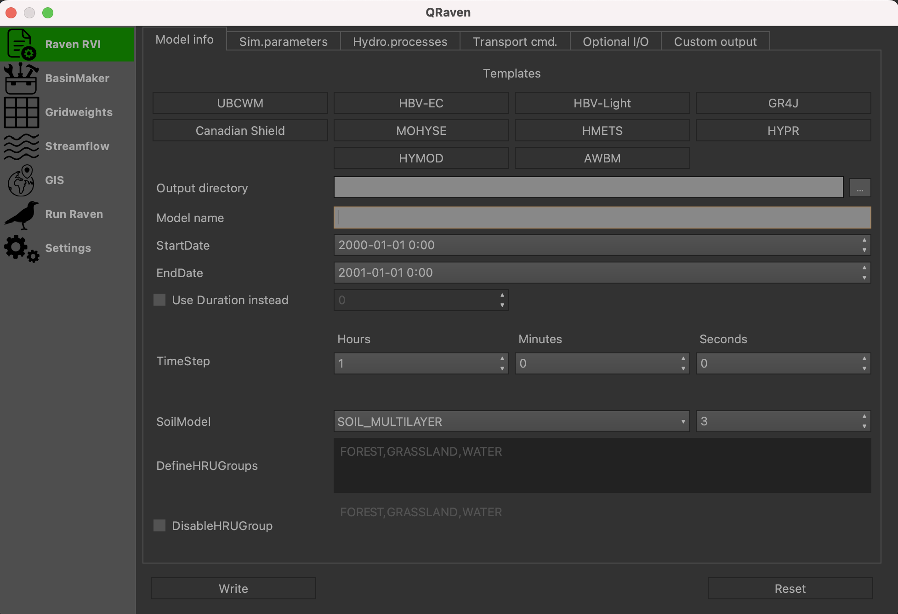
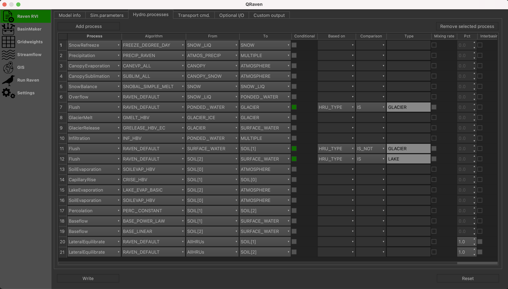
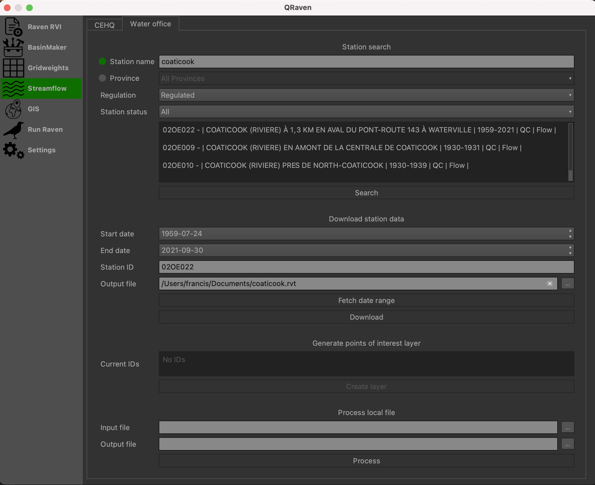

How to use QRaven
=================

.. _Usage:

Open QRaven
-----------
.. |qrvn_ico| image:: https://github.com/Scriptbash/QRaven/blob/main/qraven/icon.png?raw=true
  :width: 20

Click on the QRaven icon |qrvn_ico| in your toolbar or go in the "Plugins" menu, select the QRaven option and click on "Generate Raven input files"

.. image:: https://user-images.githubusercontent.com/98601298/170999781-22514c96-7611-424a-b946-69fd465c5181.png
  :width: 600

You will have seven main menus

 * :ref:`Raven RVI<createRVI>`
 * :ref:`BasinMaker RVH<createRVH>`
 * :ref:`GridWeights<gridweights>`
 * :ref:`Streamflow<datascrapers>`
 * :ref:`GIS<gis>`
 * :ref:`Run Model<runrvn>`
 * :ref:`Settings<settings>`

.. _createRVI:

Create a RVI file
-----------------
QRaven all started with this feature in mind. This tab can be used to create a rvi file from scratch or from a template.
The templates available are UBCWM, HBV-EC, HBV-Light, GR4J, Canadian Shield,
MOHYSE, HMETS, HYPR, HYMOD and AWBM. Those models structures were taken directly from the Raven official documentation.

This section of the plugin is pretty straight forward to use. Check/uncheck/ options, select entries in drop down lists, etc.
When ready, click on the "Write" button to write the rvi file. Otherwise, you can click on "Reset" to revert the options back to their default values.

The parameters are separated in different sections. You can find an overview of the options below; 

- Model info
   - You can find templates buttons. Simply click on the one needed and the interface will load its configuration. 
   - Basic information like the name of the model, the start/end date, time step, etc.
- Sim. parameters
   - Simulation parameters such as the catchment route, the routing method, evaporation, etc.
- Hydro. processes
   - A table that allows to set up the hydrologic processes.
   - Click on "Add process" to add a new row or "Remove selected process" to remove the selected row.
   - After selecting a process, the available algorithms for that process will be inside the algorithm drop down list. The from and to
     compartments drop down list will contain the available compartments for the select process and algorithm.
- Transport cmd
   - This work the same way as the hydrologic processes, but for the transport commands.
- Optional I/O
   - All kind of optional options like CreateRVPTemplate, evaluation metrics, debug mode, etc.
- Custom output
   - This is similar to the hydrologic processes table, but for custom outputs.

  The model info section.

  The hydrologic process table.

.. _createRVH:

Create a RVH file
-----------------
.. warning::
  The Docker daemon must be running to use this feature. Podman users don't need to worry, as Podman is daemonless.

*To-do

.. _gridweights:

Associate a NetCDF grid to the HRUs
-----------------------------------
.. warning::
  The Docker daemon must be running to use this feature. Podman users don't need to worry, as Podman is daemonless.

1. **NetCDF file** : The NetCDF file to process (inluding the file extension).
2. **Shapefile attribute** (Optional) : Only needed if the Netcdf file is a shapefile. It is the attribute containing the numbering of the subbasins.
3. **Dim name longitude (x)** : The dimension name for the longitude (e.g. rlon).
4. **Dim name latitude (y)** : The dimension name for the latitude (e.g. rlat).
5. **Var name longitude (x)** : The variable name for the longitude (e.g. lon).
6. **Var name latitude (y)** : The variable name for the latitude (e.g. lat).
7. **HRUs file** : The final shapefile created by the BasinMaker tools.
8. **Use gauge ID** and **Use subbasins ID** : Either use a gauge ID or subbasins ID. The ID must be entered manually in the field below these options.
9. **Output path** : The path and file name of the results.

.. figure:: https://user-images.githubusercontent.com/98601298/188149605-f67b527a-4069-4a51-9830-4290c79fd0b8.png
  :width: 600
  
  Example of the gridweights generator interface.

.. _datascrapers:

Download streamflow data
------------------------
QRaven can fetch hydrometric data from two providers at this time, which are the 
direction principale des prévisions hydriques et de la cartographie (DPPHC) and the Water office. Not only can it fetch data automatically,
it can also generate rvt files from the data. Only flow data is supported, level data is unsupported.

Both data scrapers work the same way, but their search criterias differ a little bit. This documentation will only cover the Water office scraper.

- Search a station
   1. Select either "Station name" or "Province".
   2. If "Station name" is selected, type in the full or patial name of the station. If "Province" is selected, select a province in the drop down list.
   3. Use the "Regulation" and "Station status" drop down lists to refine your search if needed.
   4. Click on "Search".
   5. Results will show up in the text area above the "Search" button.
   
   .. note:: 
    The station ID is always the first information in the search results. Simply copy/paste an ID into the "Station ID" field in the download section.

- Download hydrometric data
   1. In the "Station ID" field, type in the hydrometric station ID from which the data will be downloaded.
   2. In the "Output file" field, select a directory and name for the output file. The extension will always be ".rvt".
   3. Click the "Download" button.

If you have already downloaded data from one of the two providers, use the following option.

- Process a local file
   1. In the "Input file" field, select the file you want to process.
   2. In the "Output file" field, select a directory and a name for the rvt file.
   3. Click on the "Process" button. 

  Example of the Water office UI

.. _gis:

Download GIS data
-----------------
To write.

  Example of the GIS UI

.. _runrvn:

Run a Raven model
-----------------
To run a Raven model, you need to provide three information.

1. **Input directory** : The directory containing your Raven model files.
2. **Output directory** : The directory where the results of the simulation will be saved.
3. **Raven executable location** : The path to the Raven.exe file (including the filename).

Two other fields are also available, but they should be automatically filled by reading the .rvi file of your model.
If an error occurs and they are not filled automatically, please submit a `bug report <https://github.com/Scriptbash/QRaven/issues>`_.

1. **Filename prefix** : The name of the .rvi file (without the file extension)
2. **RunName** : The text following the command ":RunName" if used in the .rvi file. 

.. figure:: https://user-images.githubusercontent.com/98601298/188149995-0dbed886-7906-412a-b798-09bae286959e.png
  :width: 600
  
  Example of the Run Model interface.

Draw the hydrograph
-------------------
After running a Raven model successfully (with or without QRaven), you will be able to draw the resulting hydrograph.
To do so, all that is required is the "Output directory" field and a click on the "Draw hydrograph" button. 

In the graph window, multiple buttons are available. They will allow you to zoom in and out, modify the graph size, customize the axis and export the graph as an image.

.. figure:: https://user-images.githubusercontent.com/98601298/188150121-ff889b56-5aa3-4e17-9d7f-28848896932d.png
  :width: 450
  
  Example of an hydrograph produced by QRaven.

Autofill a .rvp template file
------------------------------
A cool feature based on a RavenR function is available to attempt to automatically fill a .rvp template file.

In order to use this feature, a few steps are required.

1. Make sure the ":CreateRVPTemplate" command is used inside the .rvi file.
2. Run the model.
3. Click on the "Auto fill rvp template".
4. Review the generated .rvp file for any values that do not have a default value. Those values will show as "0.12345".

.. note::
  This feature needs more testing and could have many oversights. To help improve it, please submit any problems you encounter by opening a `new issue <https://github.com/Scriptbash/QRaven/issues>`_.
  If possible, also send your Raven model so the issue can be easily reproduced.

.. _settings:

Settings
--------
The Settings menu allows some slight customization of QRaven for the moment. More settings may come later on.

As per now, you can select which containerization software and which image you want to use. You can also
select a side menu style.

**Containerization software**: By default, Docker is selected, but if you want to use
Podman, simply select the Podman option in the drop down list.

**Image**: This option lets you pick between the regular container image and the ARM based image. By default, MacOS
will be running the ARM based image. If your MacBook is Intel based, switch to the regular image. Linux and Windows both
default on the regular image.

**Menu bar style**: Allows you to choose between the default menu (icons with text) or a collapsed menu (icons only).

.. warning::
  After making changes to the settings, do not forget to click on the "Save" button. Otherwise, your changes will be lost after closing QGIS.

  The settings menu as of version 2.3.0